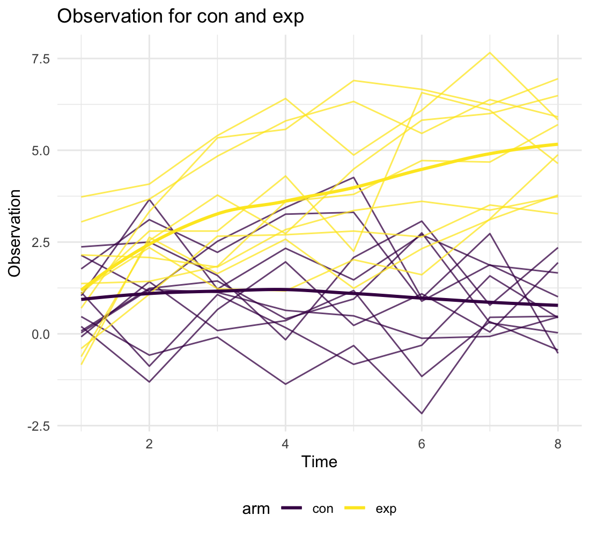

p8105\_hw5\_yl4925
================
Yiming Li
11/14/2021

# Problem 1

-   Read and describe the raw data

``` r
homicide_df = read_csv("./data/homicide-data.csv") %>% 
  janitor::clean_names() %>% 
  mutate(city_state = str_c(city, ",", state)) %>%  # create city-state variable
  mutate(whether_solved = case_when(
    disposition == "Closed without arrest" ~ "unsolved",
    disposition == "Open/No arrest" ~ "unsolved",
    disposition == "Closed by arrest" ~ "solved"
  )) %>%  # create a new variable to show whether solved or not
  filter(state != "AL" | city != "Tulsa") # Tulsa should not belong to AL, so remove it
```

Here is a wrong row, where the state of Tulsa is AL not OK. So I remove
this row.

-   Create unsolved and total homicide dataframe for each state

``` r
unsolved_VS_total = homicide_df %>% 
  group_by(city_state) %>% 
  summarise(
    unsolved_count = sum(whether_solved == "unsolved"),
    total_count = n()
  )
unsolved_VS_total %>% 
  head() %>% 
  knitr::kable()
```

| city\_state    | unsolved\_count | total\_count |
|:---------------|----------------:|-------------:|
| Albuquerque,NM |             146 |          378 |
| Atlanta,GA     |             373 |          973 |
| Baltimore,MD   |            1825 |         2827 |
| Baton Rouge,LA |             196 |          424 |
| Birmingham,AL  |             347 |          800 |
| Boston,MA      |             310 |          614 |

We can easily find solved and unsolved homicide data for specific city
such as Baltimore

``` r
Baltimore_homicide = 
  unsolved_VS_total %>% 
  filter(city_state == "Baltimore,MD") 
```

Then we want to apply proportion test for Baltimore.

``` r
Baltimore_proportions_test = 
  prop.test(Baltimore_homicide$unsolved_count, sum(Baltimore_homicide$total_count)) %>% 
  broom::tidy()
estimated_proportion = Baltimore_proportions_test %>% 
  pull(estimate)
lower_CI_proportion = Baltimore_proportions_test %>% 
  pull(conf.low)
upper_CI_proportion = Baltimore_proportions_test %>% 
  pull(conf.high)
```

The estimated proportion is 0.6455607, and the 95% confidence interval
for proportion is \[0.6275625, 0.6631599\]

-   Proportion test for all cities

``` r
proportion_result = purrr::map2(.x = unsolved_VS_total$unsolved_count, 
                                .y = unsolved_VS_total$total_count, 
                                ~prop.test(x = .x, n = .y)) # use map2 function to do proportion test
tidy_proportion_result = purrr::map(.x = proportion_result, ~broom::tidy(.x)) # use map function to do tidy 

proportion_table = tibble(
  city_state = unsolved_VS_total$city_state, 
  data = tidy_proportion_result
) %>% 
  unnest(cols = data) %>% 
  select(city_state, estimate, conf.low, conf.high) 

proportion_table %>% 
  head() %>% 
  knitr::kable()
```

| city\_state    |  estimate |  conf.low | conf.high |
|:---------------|----------:|----------:|----------:|
| Albuquerque,NM | 0.3862434 | 0.3372604 | 0.4375766 |
| Atlanta,GA     | 0.3833505 | 0.3528119 | 0.4148219 |
| Baltimore,MD   | 0.6455607 | 0.6275625 | 0.6631599 |
| Baton Rouge,LA | 0.4622642 | 0.4141987 | 0.5110240 |
| Birmingham,AL  | 0.4337500 | 0.3991889 | 0.4689557 |
| Boston,MA      | 0.5048860 | 0.4646219 | 0.5450881 |

-   Estimate and CI plot

``` r
proportion_table %>% 
  mutate(city_state = fct_reorder(city_state, estimate)) %>% 
  ggplot(aes(city_state, estimate)) +
  geom_point() + 
  geom_errorbar(aes(ymin = conf.low, ymax = conf.high)) + 
  theme(axis.text.x = element_text(angle = 90, vjust = 0.5, hjust = 1)) +
  labs(title = "City Unsolved Proportion", x = "City,State", y = "Unsolved Proportion")
```


# Problem 2

-   Get separate file name and path

``` r
filename = list.files(path = "./data/p2data") # file name
pathname = str_c("./data/p2data/", filename) # path
arm_id  = str_remove(filename, pattern = ".csv") #arm and id list
```

-   Integrate dataframe

``` r
longitudinal_df = tibble(
  arm_id,
  data = purrr::map(.x = pathname, ~read_csv(.x)) # use map function to read list element
) %>% 
  unnest(cols = data) %>% 
  mutate(arm_and_id = arm_id) %>% 
  separate(arm_and_id, into = c("arm", "id"), sep = "_") %>% 
  mutate(arm = ifelse(arm == "con","control","experiment"))
# we have three variables to show participants status: arm, id, arm_id
longitudinal_df %>% 
  head() %>% 
  knitr::kable()
```

| arm\_id | week\_1 | week\_2 | week\_3 | week\_4 | week\_5 | week\_6 | week\_7 | week\_8 | arm     | id  |
|:--------|--------:|--------:|--------:|--------:|--------:|--------:|--------:|--------:|:--------|:----|
| con\_01 |    0.20 |   -1.31 |    0.66 |    1.96 |    0.23 |    1.09 |    0.05 |    1.94 | control | 01  |
| con\_02 |    1.13 |   -0.88 |    1.07 |    0.17 |   -0.83 |   -0.31 |    1.58 |    0.44 | control | 02  |
| con\_03 |    1.77 |    3.11 |    2.22 |    3.26 |    3.31 |    0.89 |    1.88 |    1.01 | control | 03  |
| con\_04 |    1.04 |    3.66 |    1.22 |    2.33 |    1.47 |    2.70 |    1.87 |    1.66 | control | 04  |
| con\_05 |    0.47 |   -0.58 |   -0.09 |   -1.37 |   -0.32 |   -2.17 |    0.45 |    0.48 | control | 05  |
| con\_06 |    2.37 |    2.50 |    1.59 |   -0.16 |    2.08 |    3.07 |    0.78 |    2.35 | control | 06  |

-   Do some cleaning

``` r
tidy_longitudinal_df = longitudinal_df %>% 
  pivot_longer(
    week_1:week_8,
    names_to = "time",
    names_prefix = "week_",
    values_to = "observations"
  ) 
```

-   Make spaghetti plot

``` r
tidy_longitudinal_df %>% 
  mutate(time = as.numeric(time)) %>% 
  ggplot(aes(time, observations, color = arm)) +
  geom_line(aes(group = arm_id), alpha = 0.75) +
  geom_smooth(se = FALSE) +
  labs(x = "Time",
       y = "Observation",
       title = "Observation for control and experiment")
```



According to smooth line, the observations for control group almost keep
the same from week 1 to week 8. But the observations for experimental
group have the increasing tendency. The overall observations value for
experimental group is higher than con group.

# Problem 3

-   Load iris missing data

``` r
set.seed(10)

iris_with_missing = iris %>% 
  map_df(~replace(.x, sample(1:150, 20), NA)) %>%
  mutate(Species = as.character(Species))
```

-   Writing filling function

``` r
fill_missing_iris = function(x) {
  if (is.numeric(x)) {
    value = mean(x, na.rm = TRUE)
    x[is.na(x)] = value
  } else if (is.character(x)) {
    x[is.na(x)] = "virginica"
  }
  return(x)
}
```

``` r
filled_iris = iris_with_missing %>% 
  map_df(~fill_missing_iris(.x))

filled_iris %>% 
  head() %>% 
  knitr::kable()
```

| Sepal.Length | Sepal.Width | Petal.Length | Petal.Width | Species |
|-------------:|------------:|-------------:|------------:|:--------|
|          5.1 |         3.5 |          1.4 |    0.200000 | setosa  |
|          4.9 |         3.0 |          1.4 |    0.200000 | setosa  |
|          4.7 |         3.2 |          1.3 |    0.200000 | setosa  |
|          4.6 |         3.1 |          1.5 |    1.192308 | setosa  |
|          5.0 |         3.6 |          1.4 |    0.200000 | setosa  |
|          5.4 |         3.9 |          1.7 |    0.400000 | setosa  |
