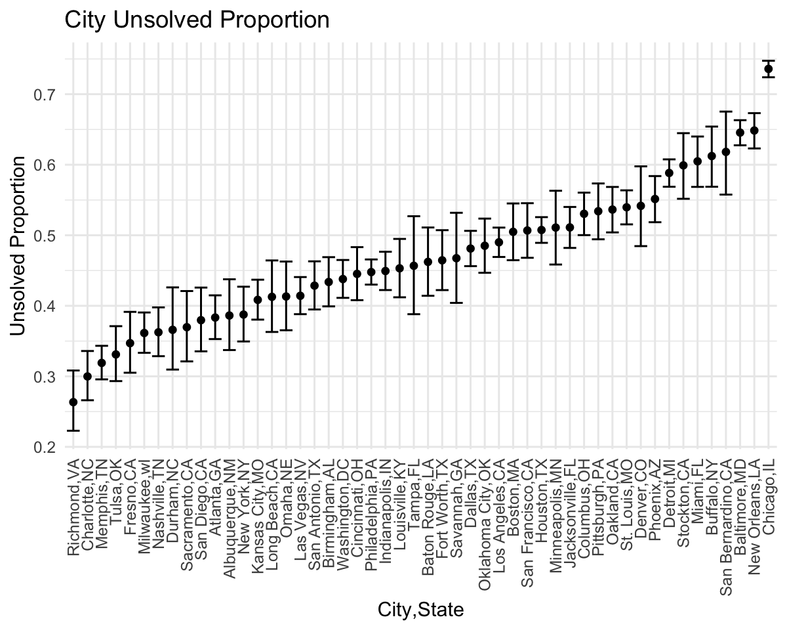
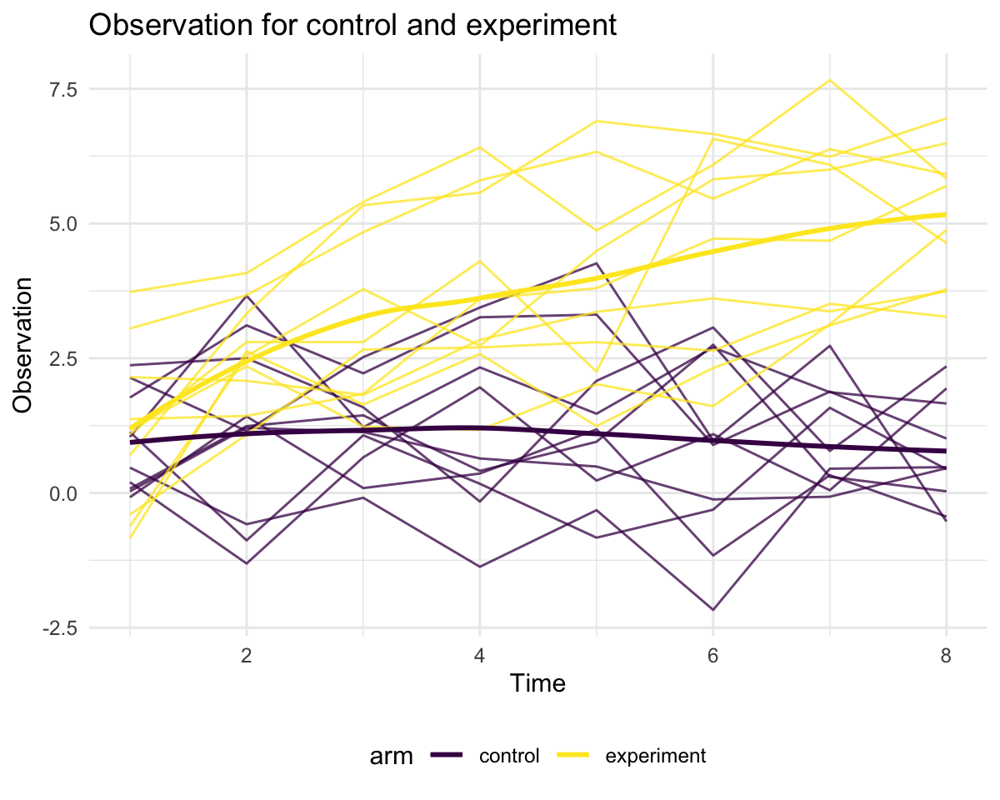

p8105\_hw5\_yl4925
================
Yiming Li
11/14/2021

# Problem 1

-   Read and describe the raw data

``` r
homicide_df = read_csv("./data/homicide-data.csv") %>% 
  janitor::clean_names() %>% 
  mutate(city_state = str_c(city, ",", state)) %>%  # create city-state variable
  mutate(whether_solved = case_when(
    disposition == "Closed without arrest" ~ "unsolved",
    disposition == "Open/No arrest" ~ "unsolved",
    disposition == "Closed by arrest" ~ "solved"
  )) %>%  # create a new variable to show whether solved or not
  filter(state != "AL" | city != "Tulsa") # Tulsa should not belong to AL, so remove it
```

Here is a wrong row, where the state of Tulsa is AL not OK. So I remove
this row.

This dataframe contains 14 variables to describe homicide. It includes
specific uid for each homicide, time of homicide, location of
homicide(city, state, longitude and latitude), status of victim(name,
age, sex and race) and disposition for homicide.

-   Create unsolved and total homicide dataframe for each state

``` r
unsolved_VS_total = homicide_df %>% 
  group_by(city_state) %>% 
  summarise(
    unsolved_count = sum(whether_solved == "unsolved"),
    total_count = n()
  )
unsolved_VS_total 
```

    ## # A tibble: 50 × 3
    ##    city_state     unsolved_count total_count
    ##    <chr>                   <int>       <int>
    ##  1 Albuquerque,NM            146         378
    ##  2 Atlanta,GA                373         973
    ##  3 Baltimore,MD             1825        2827
    ##  4 Baton Rouge,LA            196         424
    ##  5 Birmingham,AL             347         800
    ##  6 Boston,MA                 310         614
    ##  7 Buffalo,NY                319         521
    ##  8 Charlotte,NC              206         687
    ##  9 Chicago,IL               4073        5535
    ## 10 Cincinnati,OH             309         694
    ## # … with 40 more rows

We can easily find solved and unsolved homicide data for specific city
such as Baltimore

``` r
Baltimore_homicide = 
  unsolved_VS_total %>% 
  filter(city_state == "Baltimore,MD") 
```

Then we want to apply proportion test for Baltimore.

``` r
Baltimore_proportions_test = 
  prop.test(Baltimore_homicide$unsolved_count, sum(Baltimore_homicide$total_count)) %>% 
  broom::tidy()
Baltimore_proportions_test 
```

    ## # A tibble: 1 × 8
    ##   estimate statistic  p.value parameter conf.low conf.high method    alternative
    ##      <dbl>     <dbl>    <dbl>     <int>    <dbl>     <dbl> <chr>     <chr>      
    ## 1    0.646      239. 6.46e-54         1    0.628     0.663 1-sample… two.sided

And we can pull its CI and estimated proportion.

``` r
estimated_proportion = Baltimore_proportions_test %>% 
  pull(estimate)
lower_CI_proportion = Baltimore_proportions_test %>% 
  pull(conf.low)
upper_CI_proportion = Baltimore_proportions_test %>% 
  pull(conf.high)
```

The estimated proportion for Baltimore is 0.6455607, and the 95%
confidence interval for proportion is \[0.6275625, 0.6631599\]

-   Proportion test for all cities

``` r
proportion_table = 
  unsolved_VS_total %>% 
  mutate(
    proportion_result = purrr::map2(.x = unsolved_count, 
                                    .y = total_count, 
                                    ~prop.test(x = .x, n = .y)), # use map2 function to do proportion test
    tidy_proportion_result = purrr::map(.x = proportion_result, ~broom::tidy(.x)) # use map function to do tidy
  ) %>% 
  select(-proportion_result) %>% 
  unnest(tidy_proportion_result) %>% 
  select(city_state, estimate, conf.low, conf.high) 

proportion_table 
```

    ## # A tibble: 50 × 4
    ##    city_state     estimate conf.low conf.high
    ##    <chr>             <dbl>    <dbl>     <dbl>
    ##  1 Albuquerque,NM    0.386    0.337     0.438
    ##  2 Atlanta,GA        0.383    0.353     0.415
    ##  3 Baltimore,MD      0.646    0.628     0.663
    ##  4 Baton Rouge,LA    0.462    0.414     0.511
    ##  5 Birmingham,AL     0.434    0.399     0.469
    ##  6 Boston,MA         0.505    0.465     0.545
    ##  7 Buffalo,NY        0.612    0.569     0.654
    ##  8 Charlotte,NC      0.300    0.266     0.336
    ##  9 Chicago,IL        0.736    0.724     0.747
    ## 10 Cincinnati,OH     0.445    0.408     0.483
    ## # … with 40 more rows

-   Estimate and CI plot

``` r
proportion_table %>% 
  mutate(city_state = fct_reorder(city_state, estimate)) %>% 
  ggplot(aes(city_state, estimate)) +
  geom_point() + 
  geom_errorbar(aes(ymin = conf.low, ymax = conf.high)) + 
  theme(axis.text.x = element_text(angle = 90, vjust = 0.5, hjust = 1)) +
  labs(title = "City Unsolved Proportion", x = "City,State", y = "Unsolved Proportion")
```



# Problem 2

-   Get separate file name and path

``` r
filename = list.files(path = "./data/p2data") # file name
pathname = str_c("./data/p2data/", filename) # path
```

-   Integrate dataframe

``` r
longitudinal_df = tibble(
  filename,
  data = purrr::map(.x = pathname, ~read_csv(.x)) # use map function to read list element
) %>% 
  unnest(cols = data) %>% 
  mutate(arm_id = str_remove(filename, pattern = ".csv")) %>% 
  separate(arm_id, into = c("arm", "id"), sep = "_") %>% 
  mutate(arm = ifelse(arm == "con","control","experiment")) %>% 
  select(-filename)
# we have two variables to show participants status: arm, id
longitudinal_df 
```

    ## # A tibble: 20 × 10
    ##    week_1 week_2 week_3 week_4 week_5 week_6 week_7 week_8 arm        id   
    ##     <dbl>  <dbl>  <dbl>  <dbl>  <dbl>  <dbl>  <dbl>  <dbl> <chr>      <chr>
    ##  1   0.2   -1.31   0.66   1.96   0.23   1.09   0.05   1.94 control    01   
    ##  2   1.13  -0.88   1.07   0.17  -0.83  -0.31   1.58   0.44 control    02   
    ##  3   1.77   3.11   2.22   3.26   3.31   0.89   1.88   1.01 control    03   
    ##  4   1.04   3.66   1.22   2.33   1.47   2.7    1.87   1.66 control    04   
    ##  5   0.47  -0.58  -0.09  -1.37  -0.32  -2.17   0.45   0.48 control    05   
    ##  6   2.37   2.5    1.59  -0.16   2.08   3.07   0.78   2.35 control    06   
    ##  7   0.03   1.21   1.13   0.64   0.49  -0.12  -0.07   0.46 control    07   
    ##  8  -0.08   1.42   0.09   0.36   1.18  -1.16   0.33  -0.44 control    08   
    ##  9   0.08   1.24   1.44   0.41   0.95   2.75   0.3    0.03 control    09   
    ## 10   2.14   1.15   2.52   3.44   4.26   0.97   2.73  -0.53 control    10   
    ## 11   3.05   3.67   4.84   5.8    6.33   5.46   6.38   5.91 experiment 01   
    ## 12  -0.84   2.63   1.64   2.58   1.24   2.32   3.11   3.78 experiment 02   
    ## 13   2.15   2.08   1.82   2.84   3.36   3.61   3.37   3.74 experiment 03   
    ## 14  -0.62   2.54   3.78   2.73   4.49   5.82   6      6.49 experiment 04   
    ## 15   0.7    3.33   5.34   5.57   6.9    6.66   6.24   6.95 experiment 05   
    ## 16   3.73   4.08   5.4    6.41   4.87   6.09   7.66   5.83 experiment 06   
    ## 17   1.18   2.35   1.23   1.17   2.02   1.61   3.13   4.88 experiment 07   
    ## 18   1.37   1.43   1.84   3.6    3.8    4.72   4.68   5.7  experiment 08   
    ## 19  -0.4    1.08   2.66   2.7    2.8    2.64   3.51   3.27 experiment 09   
    ## 20   1.09   2.8    2.8    4.3    2.25   6.57   6.09   4.64 experiment 10

-   Do some cleaning

``` r
tidy_longitudinal_df = longitudinal_df %>% 
  pivot_longer(
    week_1:week_8,
    names_to = "time",
    names_prefix = "week_",
    values_to = "observations"
  ) 
tidy_longitudinal_df 
```

    ## # A tibble: 160 × 4
    ##    arm     id    time  observations
    ##    <chr>   <chr> <chr>        <dbl>
    ##  1 control 01    1             0.2 
    ##  2 control 01    2            -1.31
    ##  3 control 01    3             0.66
    ##  4 control 01    4             1.96
    ##  5 control 01    5             0.23
    ##  6 control 01    6             1.09
    ##  7 control 01    7             0.05
    ##  8 control 01    8             1.94
    ##  9 control 02    1             1.13
    ## 10 control 02    2            -0.88
    ## # … with 150 more rows

-   Make spaghetti plot

``` r
tidy_longitudinal_df %>% 
  mutate(time = as.numeric(time)) %>% 
  unite("arm_id", c(arm, id), sep = "_", remove = F) %>% 
  ggplot(aes(time, observations, color = arm)) +
  geom_line(aes(group = arm_id), alpha = 0.75) +
  geom_smooth(se = FALSE) +
  labs(x = "Time",
       y = "Observation",
       title = "Observation for control and experiment")
```



According to smooth line, the observations for control group almost keep
the same from week 1 to week 8. But the observations for experimental
group have the increasing tendency. The overall observations value for
experimental group is higher than con group.

# Problem 3

-   Load iris missing data

``` r
set.seed(10)

iris_with_missing = iris %>% 
  map_df(~replace(.x, sample(1:150, 20), NA)) %>%
  mutate(Species = as.character(Species))

iris_with_missing
```

    ## # A tibble: 150 × 5
    ##    Sepal.Length Sepal.Width Petal.Length Petal.Width Species
    ##           <dbl>       <dbl>        <dbl>       <dbl> <chr>  
    ##  1          5.1         3.5          1.4         0.2 setosa 
    ##  2          4.9         3            1.4         0.2 setosa 
    ##  3          4.7         3.2          1.3         0.2 setosa 
    ##  4          4.6         3.1          1.5        NA   setosa 
    ##  5          5           3.6          1.4         0.2 setosa 
    ##  6          5.4         3.9          1.7         0.4 setosa 
    ##  7         NA           3.4          1.4         0.3 setosa 
    ##  8          5           3.4          1.5         0.2 setosa 
    ##  9          4.4         2.9          1.4         0.2 setosa 
    ## 10          4.9         3.1         NA           0.1 setosa 
    ## # … with 140 more rows

-   Writing filling function

``` r
fill_missing_iris = function(x) {
  if (is.numeric(x)) {
    value = mean(x, na.rm = TRUE)
    x[is.na(x)] = value
  } else if (is.character(x)) {
    x[is.na(x)] = "virginica"
  }
  return(x)
}
```

-   filling the missing value

``` r
filled_iris = iris_with_missing %>% 
  map_df(~fill_missing_iris(.x))

filled_iris 
```

    ## # A tibble: 150 × 5
    ##    Sepal.Length Sepal.Width Petal.Length Petal.Width Species
    ##           <dbl>       <dbl>        <dbl>       <dbl> <chr>  
    ##  1         5.1          3.5         1.4         0.2  setosa 
    ##  2         4.9          3           1.4         0.2  setosa 
    ##  3         4.7          3.2         1.3         0.2  setosa 
    ##  4         4.6          3.1         1.5         1.19 setosa 
    ##  5         5            3.6         1.4         0.2  setosa 
    ##  6         5.4          3.9         1.7         0.4  setosa 
    ##  7         5.82         3.4         1.4         0.3  setosa 
    ##  8         5            3.4         1.5         0.2  setosa 
    ##  9         4.4          2.9         1.4         0.2  setosa 
    ## 10         4.9          3.1         3.77        0.1  setosa 
    ## # … with 140 more rows
