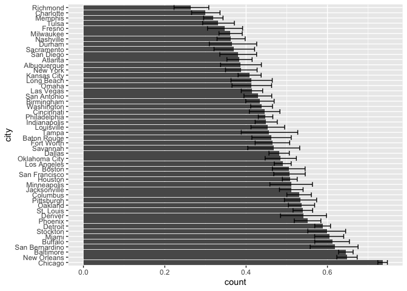

p8105\_hw5\_yl4925
================
Yiming Li
11/14/2021

``` r
library(tidyverse)
```

    ## ── Attaching packages ─────────────────────────────────────── tidyverse 1.3.1 ──

    ## ✓ ggplot2 3.3.5     ✓ purrr   0.3.4
    ## ✓ tibble  3.1.4     ✓ dplyr   1.0.7
    ## ✓ tidyr   1.1.3     ✓ stringr 1.4.0
    ## ✓ readr   2.0.1     ✓ forcats 0.5.1

    ## ── Conflicts ────────────────────────────────────────── tidyverse_conflicts() ──
    ## x dplyr::filter() masks stats::filter()
    ## x dplyr::lag()    masks stats::lag()

``` r
homicide_df = read_csv("./data/homicide-data.csv") %>% 
  janitor::clean_names() %>% 
  mutate(city_state = str_c(city, ",", state)) %>% 
  filter(state != "AL" | city != "Tulsa")
```

    ## Rows: 52179 Columns: 12

    ## ── Column specification ────────────────────────────────────────────────────────
    ## Delimiter: ","
    ## chr (9): uid, victim_last, victim_first, victim_race, victim_age, victim_sex...
    ## dbl (3): reported_date, lat, lon

    ## 
    ## ℹ Use `spec()` to retrieve the full column specification for this data.
    ## ℹ Specify the column types or set `show_col_types = FALSE` to quiet this message.

Here is a wrong row, where the state of Tulsa is AL not OK. So I remove
this row.

``` r
total_homicid = 
  homicide_df %>% 
  group_by(city) %>% 
  summarise(total_count = n())

unsolved_homicide = 
  homicide_df %>% 
  filter(disposition %in% c("Closed without arrest", "Open/No arrest")) %>% 
  group_by(city) %>% 
  summarise(unsolved_count = n())

left_join(total_homicid, unsolved_homicide)
```

    ## Joining, by = "city"

    ## # A tibble: 50 × 3
    ##    city        total_count unsolved_count
    ##    <chr>             <int>          <int>
    ##  1 Albuquerque         378            146
    ##  2 Atlanta             973            373
    ##  3 Baltimore          2827           1825
    ##  4 Baton Rouge         424            196
    ##  5 Birmingham          800            347
    ##  6 Boston              614            310
    ##  7 Buffalo             521            319
    ##  8 Charlotte           687            206
    ##  9 Chicago            5535           4073
    ## 10 Cincinnati          694            309
    ## # … with 40 more rows

Proportion test for Baltimore

``` r
Baltimore_homicide = 
  homicide_df %>% 
  filter(city_state == "Baltimore,MD") %>% 
  mutate(whether_solved = case_when(
    disposition == "Closed without arrest" ~ "unsolved",
    disposition == "Open/No arrest" ~ "unsolved",
    disposition == "Closed by arrest" ~ "solved"
  )) %>% 
  group_by(whether_solved) %>% 
  summarise(count = n())
```

``` r
Baltimore_proportions_test = prop.test(Baltimore_homicide$count[2], sum(Baltimore_homicide$count))
Baltimore_proportions_test = 
  Baltimore_proportions_test %>% 
  broom::tidy()
estimated_proportion = Baltimore_proportions_test %>% 
  pull(estimate)
lower_CI_proportion = Baltimore_proportions_test %>% 
  pull(conf.low)
upper_CI_proportion = Baltimore_proportions_test %>% 
  pull(conf.high)
```

The estimated proportion is 0.6455607, and the 95% confidence interval
for proportion is \[0.6275625, 0.6631599\]

## Proportion test for all cities

``` r
proportion_homicide = 
  homicide_df %>% 
  mutate(whether_solved = case_when(
    disposition == "Closed without arrest" ~ "unsolved",
    disposition == "Open/No arrest" ~ "unsolved",
    disposition == "Closed by arrest" ~ "solved"
  )) %>% 
  group_by(city, whether_solved) %>% 
  summarise(count = n()) %>% 
  pivot_wider(
    names_from = whether_solved,
    values_from = count
  ) %>% 
  mutate(sum = solved + unsolved) %>% 
  select(city, unsolved, sum)
```

    ## `summarise()` has grouped output by 'city'. You can override using the `.groups` argument.

``` r
proportion_result = purrr::map2(.x = proportion_homicide$unsolved, .y = proportion_homicide$sum, prop.test)
tidy_proportion_result = purrr::map(.x = proportion_result, broom::tidy)
proportion_table = tibble(
  city = proportion_homicide$city, 
  data = tidy_proportion_result
) %>% 
  unnest(cols = data) %>% 
  select(city, estimate, conf.low, conf.high) 
```

plot

``` r
proportion_table %>% 
  mutate(city = fct_reorder(city, estimate)) %>% 
  ggplot(aes(city, estimate)) +
  geom_point() + 
  geom_errorbar(aes(ymin = conf.low, ymax = conf.high)) + 
  theme(axis.text.x = element_text(angle = 90, hjust = 1)) +
  labs(title = "City Unsolved Proportion", x = "City", y = "Unsolved Proportion")
```

<!-- -->

# Problem 2

``` r
filename = list.files(path = "./data/data")
pathname = str_c("./data/data/", filename)
seperate_table_list = purrr::map(.x = pathname, read_csv)
```

``` r
arm_id  = str_remove(filename, pattern = ".csv")
tidy_longitudinal_df = tibble(
  arm_id,
  data = seperate_table_list
) %>% 
  unnest(cols = data) %>% 
  mutate(arm_and_id = arm_id) %>% 
  separate(arm_and_id, into = c("arm", "id"), sep = "_")

tidy_longitudinal_df %>% 
  pivot_longer(
    week_1:week_8,
    names_to = "time",
    names_prefix = "week_",
    values_to = "observations"
  ) %>% 
  mutate(time = as.numeric(time)) %>% 
  ggplot(aes(time, observations, color = arm_id)) +
  geom_line(aes(group = arm_id))
```

<!-- -->
