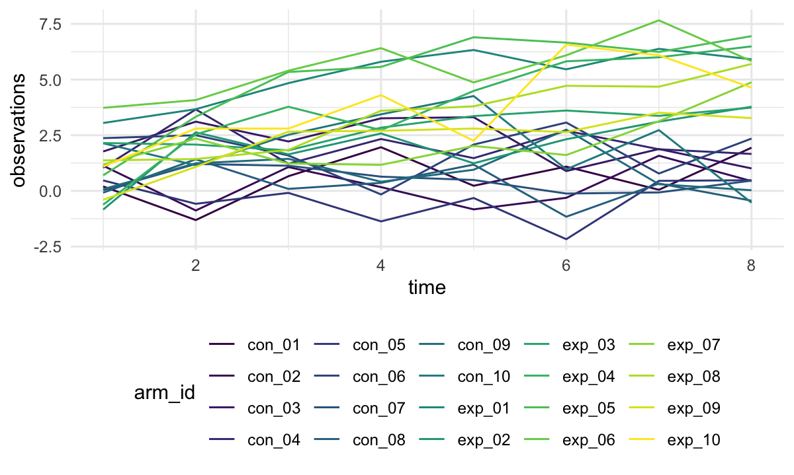

p8105\_hw5\_yl4925
================
Yiming Li
11/14/2021

# Problem 1

-   Read and describe the raw data

``` r
homicide_df = read_csv("./data/homicide-data.csv") %>% 
  janitor::clean_names() %>% 
  mutate(city_state = str_c(city, ",", state)) %>%  # create city-state variable
  mutate(whether_solved = case_when(
    disposition == "Closed without arrest" ~ "unsolved",
    disposition == "Open/No arrest" ~ "unsolved",
    disposition == "Closed by arrest" ~ "solved"
  )) %>%  # create a new variable to show whether solved or not
  filter(state != "AL" | city != "Tulsa") # Tulsa should not belong to AL, so remove it
```

Here is a wrong row, where the state of Tulsa is AL not OK. So I remove
this row.

-   Create unsolved and total homicide dataframe for each state

``` r
unsolved_VS_total = homicide_df %>% 
  group_by(city_state) %>% 
  summarise(
    unsolved_count = sum(whether_solved == "unsolved"),
    total_count = n()
  )
unsolved_VS_total %>% 
  head() %>% 
  knitr::kable()
```

| city\_state    | unsolved\_count | total\_count |
|:---------------|----------------:|-------------:|
| Albuquerque,NM |             146 |          378 |
| Atlanta,GA     |             373 |          973 |
| Baltimore,MD   |            1825 |         2827 |
| Baton Rouge,LA |             196 |          424 |
| Birmingham,AL  |             347 |          800 |
| Boston,MA      |             310 |          614 |

We can easily find solved and unsolved homicide data for specific city
such as Baltimore

``` r
Baltimore_homicide = 
  unsolved_VS_total %>% 
  filter(city_state == "Baltimore,MD") 
```

Then we want to apply proportion test for Baltimore.

``` r
Baltimore_proportions_test = 
  prop.test(Baltimore_homicide$unsolved_count, sum(Baltimore_homicide$total_count)) %>% 
  broom::tidy()
estimated_proportion = Baltimore_proportions_test %>% 
  pull(estimate)
lower_CI_proportion = Baltimore_proportions_test %>% 
  pull(conf.low)
upper_CI_proportion = Baltimore_proportions_test %>% 
  pull(conf.high)
```

The estimated proportion is 0.6455607, and the 95% confidence interval
for proportion is \[0.6275625, 0.6631599\]

-   Proportion test for all cities

``` r
proportion_result = purrr::map2(.x = unsolved_VS_total$unsolved_count, 
                                .y = unsolved_VS_total$total_count, 
                                ~prop.test(x = .x, n = .y)) # use map2 function to do proportion test
tidy_proportion_result = purrr::map(.x = proportion_result, broom::tidy) # use map function to do tidy 

proportion_table = tibble(
  city_state = unsolved_VS_total$city_state, 
  data = tidy_proportion_result
) %>% 
  unnest(cols = data) %>% 
  select(city_state, estimate, conf.low, conf.high) 

proportion_table %>% 
  head() %>% 
  knitr::kable()
```

| city\_state    |  estimate |  conf.low | conf.high |
|:---------------|----------:|----------:|----------:|
| Albuquerque,NM | 0.3862434 | 0.3372604 | 0.4375766 |
| Atlanta,GA     | 0.3833505 | 0.3528119 | 0.4148219 |
| Baltimore,MD   | 0.6455607 | 0.6275625 | 0.6631599 |
| Baton Rouge,LA | 0.4622642 | 0.4141987 | 0.5110240 |
| Birmingham,AL  | 0.4337500 | 0.3991889 | 0.4689557 |
| Boston,MA      | 0.5048860 | 0.4646219 | 0.5450881 |

-   Plot

``` r
proportion_table %>% 
  mutate(city_state = fct_reorder(city_state, estimate)) %>% 
  ggplot(aes(city_state, estimate)) +
  geom_point() + 
  geom_errorbar(aes(ymin = conf.low, ymax = conf.high)) + 
  theme(axis.text.x = element_text(angle = 90, vjust = 0.5, hjust = 1)) +
  labs(title = "City Unsolved Proportion", x = "City,State", y = "Unsolved Proportion")
```


# Problem 2

``` r
filename = list.files(path = "./data/data")
pathname = str_c("./data/data/", filename)
seperate_table_list = purrr::map(.x = pathname, read_csv)
```

``` r
arm_id  = str_remove(filename, pattern = ".csv")
tidy_longitudinal_df = tibble(
  arm_id,
  data = seperate_table_list
) %>% 
  unnest(cols = data) %>% 
  mutate(arm_and_id = arm_id) %>% 
  separate(arm_and_id, into = c("arm", "id"), sep = "_")

tidy_longitudinal_df %>% 
  pivot_longer(
    week_1:week_8,
    names_to = "time",
    names_prefix = "week_",
    values_to = "observations"
  ) %>% 
  mutate(time = as.numeric(time)) %>% 
  ggplot(aes(time, observations, color = arm_id)) +
  geom_line(aes(group = arm_id))
```



# Problem 3

``` r
set.seed(10)

iris_with_missing = iris %>% 
  map_df(~replace(.x, sample(1:150, 20), NA)) %>%
  mutate(Species = as.character(Species))
```

``` r
fill_missing_iris = function(x) {
  if (is.numeric(x)) {
    value = mean(x, na.rm = TRUE)
    x[is.na(x)] = value
  } else if (is.character(x)) {
    x[is.na(x)] = "virginica"
  }
  return(x)
}
```

``` r
filled_iris = iris_with_missing %>% 
  map_df(~fill_missing_iris(.x))
```
